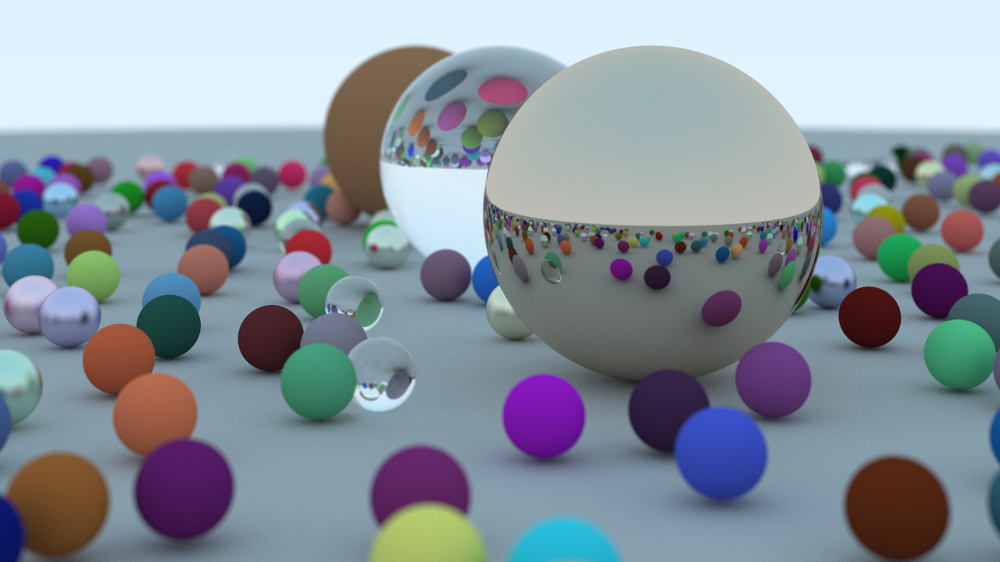

# 《Ray Tracing in one weekend》 Reproduction by C++

### Start

compile *main.cpp* and run is all your need!(C++11 version).

*middleResult* folder stored the middle result of each chapter contents in this book.

(All results have transferred from .ppm to .jpg)

### Result




 The final result is set image properties as follows  (set in main() function, 1280 * 720)  :

```c++
const float aspect_ratio = 16.0f / 9.0f;
const int image_width = 1280; // higher performance set 1920
const int image_height = static_cast<int>(image_width / aspect_ratio);
const int samples_per_pixel = 500;  // higher performance set 800
const int max_depth = 50; // bounces 50 times
```


### Reference

https://raytracing.github.io/books/RayTracingInOneWeekend.html#diffusematerials

