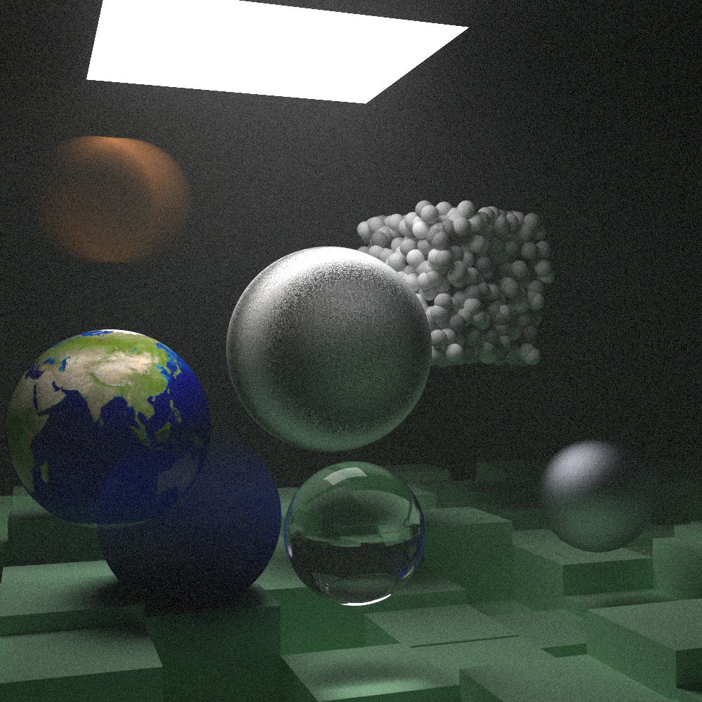

# 《Ray Tracing the next week》 Reproduction by C++

### Start

compile *main.cpp* and run(C++11 version) just like in RTone.

*middleResult* folder stored the middle result of each chapter contents in this book.

(All results have transferred from .ppm to .jpg)

the texture earthimage.jpg in Source

### Result




 The final result is set image properties as follows  (set in main() function, 1000 * 1000)  :

```c++
...
case 7:
		world = final_scene();
		aspect_ratio = 1.0;
		image_width = 1000;
		image_height = static_cast<int>(image_width / aspect_ratio);
		samples_per_pixel = 1000; // Note the book set 10000, but It need too long time
		background = color(0, 0, 0);
		lookfrom = point3(478, 278, -600);
		lookat = point3(278, 278, 0);
		fov_degree = 40.0f;
		aperture = 0.0f;
	break;
...
```


### Reference

https://raytracing.github.io/books/RayTracingTheNextWeek.html

