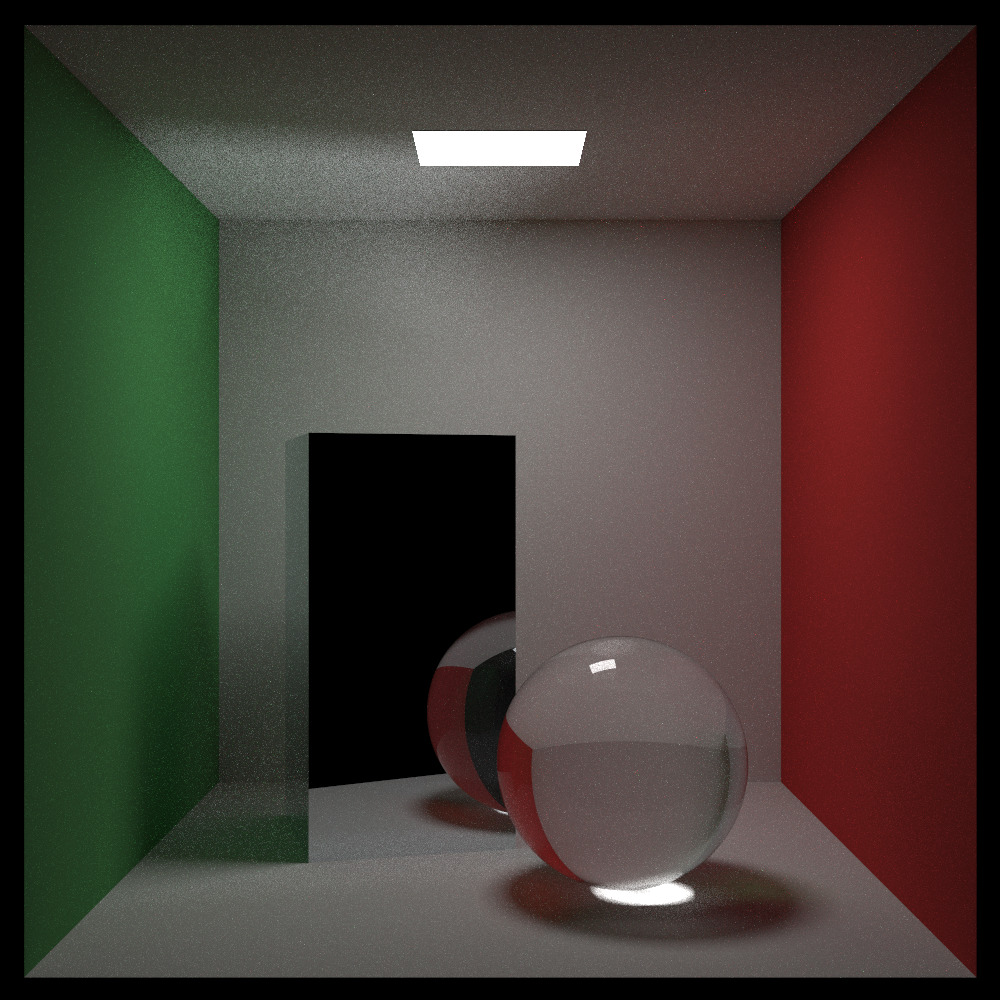

# 《Ray Tracing the rest of your life》 Reproduction by C++

### Start

compile *main.cpp* and run(C++11 version) just like in RTone.

*middleResult* folder stored the middle result of each chapter contents in this book and sampling demo code .

MCIntegrationPractice is Monte Carlo Intergration practice in 2-4 chapter

(All results have transferred from .ppm to .jpg)

the texture earthimage.jpg in Source

### Result




 The final result is set image properties as follows  (set in main() function, 1000 * 1000)  :

```c++
	int samples_per_pixel = 1000;
	...
	world = cornell_box();
	aspect_ratio = 1.0;
	image_width = 1000;
	image_height = static_cast<int>(image_width / aspect_ratio);
	background = color(0.0, 0.0, 0.0);
	lookfrom = point3(278, 278, -800);
	lookat = point3(278, 278, 0);
	fov_degree = 40.0f;
	aperture = 0.0f;
```


### Reference

https://raytracing.github.io/books/RayTracingTheRestOfYourLife.html

